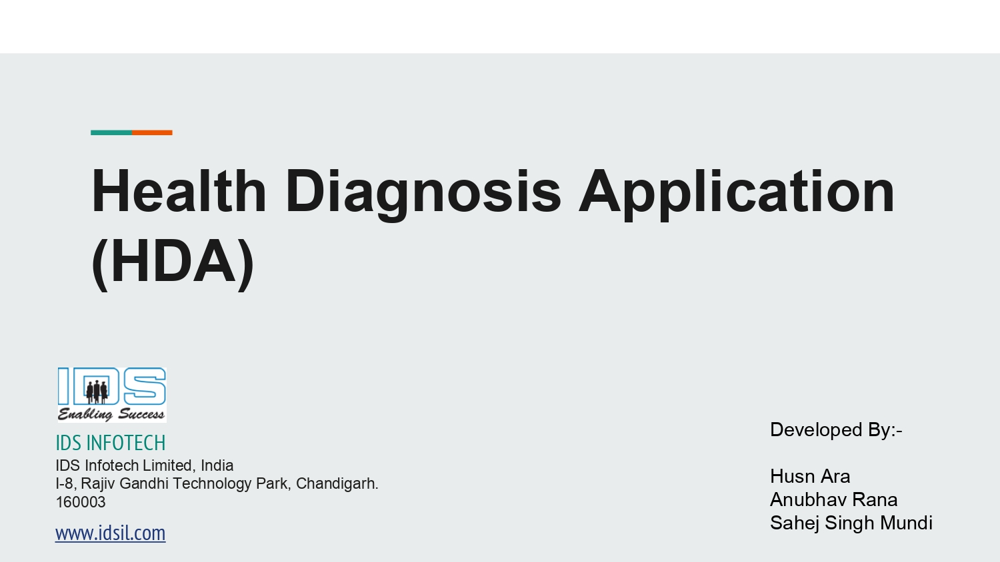

<h1># Lung-Cancer-Detection</h1>

Lung Cancer Detection model for detection of two types of Lung Cancer:  1. Adenocarcinoma  2. Squamous Cell Carcinoma. 
Input image requirement : Histopathology Image 
Output: Lung Cancer Type or Normal report with Probability Score 
ML Algorithm: ResNet50

